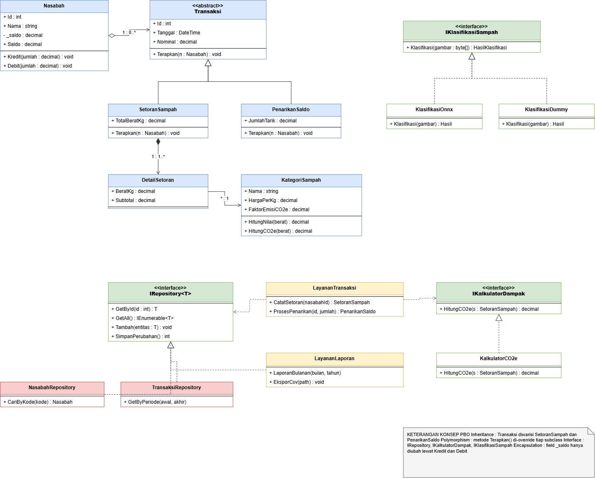

# TRASHURY
Aplikasi kasir dan manajemen database lokal berbasis desktop untuk memodernisasi operasional bank sampah kalurahan tanpa ketergantungan internet penuh.

<<<<<<< Updated upstream
Kelompok Keren
Ketua Kelompok: Muhammad Afiq Mirza Choiruzan-24/537942/TK/59646
Anggota 1: Wangsit Nursyahada-24/545092/TK/60594
Anggota 2: Bintang Daneswara
=======
Kelompok Keren  
Ketua Kelompok: Muhammad Afiq Mirza Choiruzan-24/537942/TK/59646  
Anggota 1: Wangsit Nursyahada-24/545092/TK/60594  
Anggota 2: Bintang Daneswara-24/541599/TK/60084

## Class Diagram

## Struktur Class

| Class / Interface | Peran |
|---|---|
| `Nasabah` | Data nasabah dan saldo tabungan |
| `Transaksi` *(abstract)* | Induk seluruh transaksi |
| `SetoranSampah` | Subclass Transaksi, menambah saldo |
| `PenarikanSaldo` | Subclass Transaksi, mengurangi saldo |
| `DetailSetoran` | Baris rincian dalam satu setoran |
| `KategoriSampah` | Harga per kg dan faktor emisi CO2e |
| `HasilKlasifikasi` | Keluaran model klasifikasi foto |
| `IRepository<T>` | Kontrak akses data |
| `NasabahRepository` | Implementasi repository nasabah |
| `TransaksiRepository` | Implementasi repository transaksi |
| `LayananTransaksi` | Alur catat setoran dan proses penarikan |
| `LayananLaporan` | Laporan bulanan dan ekspor CSV |
| `IKalkulatorDampak` / `KalkulatorCO2e` | Perhitungan emisi yang dihindari |
| `IKlasifikasiSampah` | Kontrak klasifikasi sampah dari foto |
| `KlasifikasiOnnx` / `KlasifikasiDummy` | Implementasi model dan versi dummy |

## Penerapan Konsep PBO

**Encapsulation.** Field `_saldo` pada `Nasabah` bersifat `private` dan
property `Saldo` dibuat `get`-only. Satu-satunya jalan mengubah saldo
adalah lewat `Kredit()` dan `Debit()`, yang sekaligus memvalidasi jumlah
dan mencegah saldo minus.

**Inheritance.** `SetoranSampah` dan `PenarikanSaldo` mewarisi class
abstract `Transaksi`, sehingga atribut `Id`, `Tanggal`, dan `Nominal`
cukup ditulis satu kali.

**Polymorphism.** Method `Terapkan(Nasabah)` di-override oleh tiap
subclass dengan perilaku berbeda. Kode pemanggil cukup menangani tipe
`Transaksi` tanpa mengecek jenisnya satu per satu.

**Interface.** `IRepository<T>`, `IKalkulatorDampak`, dan
`IKlasifikasiSampah` memisahkan kontrak dari implementasi, sehingga
penyimpanan data maupun model klasifikasi bisa ditukar tanpa mengubah
class layanan.

## Analisis Kualitas Class

**Coupling.** `LayananTransaksi` menerima repository dan kalkulator lewat
constructor, bukan membuatnya sendiri, sehingga ikatan antar modul tetap
longgar.

**Cohesion.** Tiap class mengurus satu urusan: `KategoriSampah` hanya
menghitung nilai dan emisi, `LayananLaporan` hanya mengurus pelaporan.

**Sufficiency, completeness, primitiveness.** Operasi dipecah ke satuan
terkecil, misalnya `KategoriSampah.HitungNilai()` dipanggil kembali oleh
`DetailSetoran` dan `SetoranSampah` tanpa menduplikasi rumus.
>>>>>>> Stashed changes
