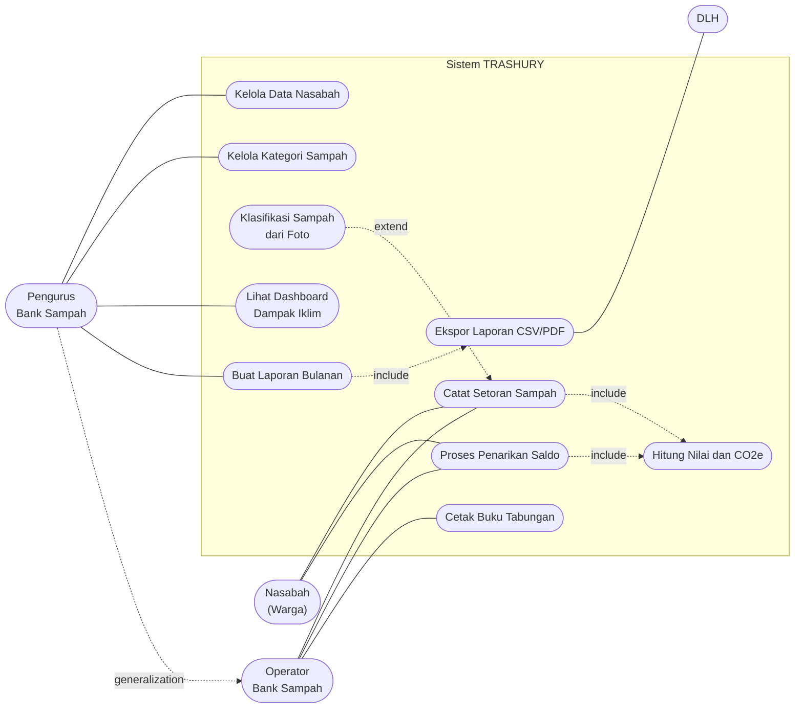
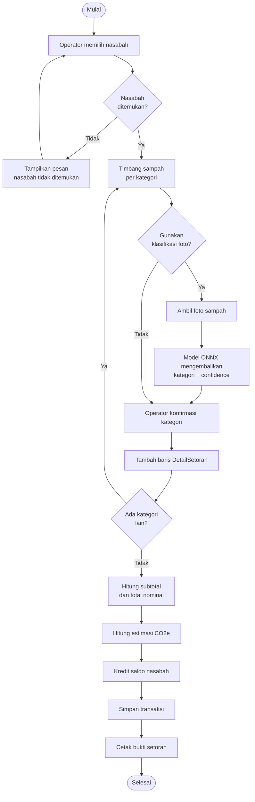
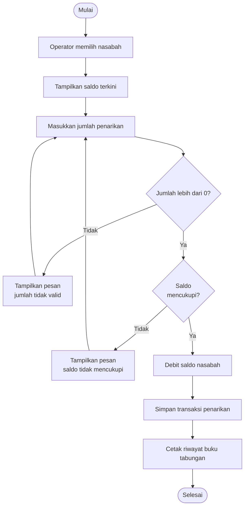
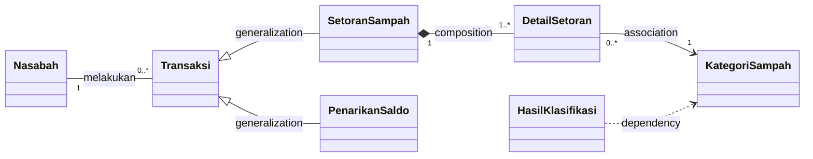

# TRASHURY

**Ubah sampah jadi harta, kelola bank sampah lebih rapi.**

Aplikasi kasir dan manajemen data lokal berbasis desktop untuk memodernisasi operasional bank sampah tingkat RW–kalurahan tanpa ketergantungan internet penuh, sekaligus menghitung otomatis dampak iklim dari sampah yang berhasil dialihkan dari TPA.

| | |
|---|---|
| **Tema** | Climate Action |
| **Mata Kuliah** | Praktikum Junior Project TI |
| **Instansi** | Departemen Teknik Elektro dan Teknologi Informasi, Fakultas Teknik, Universitas Gadjah Mada |
| **Platform** | Aplikasi desktop Windows — C# / .NET 8 / WPF (MVVM) |
| **Kelompok** | Kelompok Keren |

## Anggota Kelompok

| Nama | NIM | Peran |
|---|---|---|
| Muhammad Afiq Mirza Choiruzan | 24/537942/TK/59646 | Ketua Kelompok — AI Engineer (model klasifikasi sampah ONNX) |
| Wangsit Nursyahada | 24/545092/TK/60594 | Backend Developer (`Models/`, `Interfaces/`, `Repositories/`, `Services/`) |
| Bintang Daneswara | 24/541599/TK/60084 | Frontend Developer (`Views/`, `ViewModels/`) |

> **Catatan.** Instruksi praktikum menyebut tiga peran baku: *software architect*, *backend developer*, dan *frontend developer*. Pemetaan di atas menyesuaikan kebutuhan produk, karena TRASHURY memuat komponen AI. Konfirmasikan ke asisten praktikum bila penamaan peran harus persis mengikuti instruksi.

---

## Modul 1 — Ide Aplikasi

**Nama Produk:** TRASHURY (*Trash* + *Treasury*)

**Jenis Produk:** Aplikasi desktop Windows (WPF + MVVM), *offline-first*, untuk pengelola/operator bank sampah lokal — bukan untuk konsumen akhir.

### Latar Belakang & Permasalahan

Mayoritas pengurus bank sampah tingkat RW–kalurahan masih mencatat transaksi warga secara manual di buku tulis atau spreadsheet Excel, sehingga rentan hilang dan salah hitung. Selain itu belum ada sistem otomatis untuk menghitung dampak lingkungan (estimasi CO2e yang dihindari) yang dibutuhkan saat pelaporan ke Dinas Lingkungan Hidup (DLH). Koneksi internet di lokasi juga sering tidak stabil, sehingga solusi berbasis web penuh tidak realistis.

### Ide / Solusi

Aplikasi manajemen bank sampah lokal berbasis desktop dengan enam fitur utama:

1. **Master Data** — pengelolaan data nasabah dan kategori sampah (harga per kg + faktor emisi).
2. **Transaksi Setoran** — pencatatan setoran multi-kategori dengan perhitungan nilai otomatis.
3. **Penarikan Saldo** — penarikan tabungan nasabah dan cetak riwayat buku tabungan.
4. **Dashboard Dampak Iklim** — estimasi CO2e yang dihindari dari sampah terkumpul.
5. **Laporan Bulanan** — rekap periodik dan ekspor CSV/PDF untuk pelaporan DLH.
6. **Klasifikasi Sampah berbasis AI** — inferensi model ONNX secara *offline* dari foto sampah.

### Relevansi dengan Tema Climate Action

Setiap kilogram sampah yang berhasil didaur ulang melalui bank sampah berarti emisi gas rumah kaca yang tidak jadi dilepaskan dari TPA. TRASHURY mengubah angka itu dari perkiraan kasar menjadi data terukur per transaksi, sehingga kontribusi iklim bank sampah tingkat kalurahan menjadi dapat dilaporkan dan diverifikasi.

### Analisis Kompetitor

| Solusi | Model | Keterbatasan |
|---|---|---|
| Smash.id, Rapel | Aplikasi mobile berbasis internet | Berorientasi konsumen/penjemputan, butuh koneksi, tidak mengelola pembukuan internal bank sampah |
| Buku tulis / Excel | Manual | Rentan hilang & salah hitung, tidak ada perhitungan dampak iklim |

**Diferensiasi TRASHURY:** *offline-first*, menyasar operator bank sampah (bukan konsumen), dan satu-satunya yang menghitung estimasi CO2e secara otomatis per transaksi.

---

## Modul 2 — Perancangan Perangkat Lunak dengan Pendekatan Objek (UML)

### 2.1 Use Case Diagram

**Aktor:**

| Aktor | Peran dalam sistem |
|---|---|
| **Operator Bank Sampah** | Aktor utama. Melayani nasabah di meja setoran: mencatat setoran, memproses penarikan, mencetak buku tabungan. |
| **Pengurus Bank Sampah** | *Generalization* dari Operator. Selain semua kewenangan operator, dapat mengelola master data dan menghasilkan laporan bulanan. |
| **Nasabah (Warga)** | Aktor tidak langsung. Menyetor sampah dan menarik saldo, dilayani lewat Operator. |
| **DLH** | Aktor eksternal sekunder. Penerima berkas laporan bulanan hasil ekspor. |



**Penjelasan relasi:**

- **Generalization** — `Pengurus` adalah spesialisasi dari `Operator`; seluruh use case operator otomatis dapat diakses pengurus.
- **Include** — `Catat Setoran Sampah` selalu memanggil `Hitung Nilai & CO2e`; tanpa langkah ini setoran tidak punya nominal. `Buat Laporan Bulanan` selalu menyertakan `Ekspor Laporan`.
- **Extend** — `Klasifikasi Sampah dari Foto` bersifat opsional: setoran tetap bisa dicatat manual bila operator sudah tahu kategorinya.
- **Association** — garis lurus antara aktor dan use case yang langsung dipicu aktor tersebut.

### 2.2 Activity Diagram

#### (a) Catat Setoran Sampah



#### (b) Proses Penarikan Saldo



### 2.3 Class Diagram — Domain Model

Sesuai instruksi Modul 2, diagram berikut adalah **domain model**: hanya entitas dan relasinya, tanpa detail atribut maupun method implementasi. Versi lengkap dengan atribut dan operasi ada di Modul 3.



**Penjelasan relasi:**

- **Generalization** — `SetoranSampah` dan `PenarikanSaldo` adalah spesialisasi dari `Transaksi`.
- **Composition** — `DetailSetoran` tidak punya makna di luar induknya; bila satu `SetoranSampah` dihapus, seluruh barisnya ikut hilang.
- **Association + multiplicity** — satu `Nasabah` dapat memiliki nol sampai banyak `Transaksi`; satu setoran memuat minimal satu `DetailSetoran`.
- **Dependency** — `HasilKlasifikasi` hanya mengacu pada nama kategori untuk dipetakan ke `KategoriSampah`, tanpa menyimpan objeknya.

---

## Modul 3 — Desain Class

### Class Diagram


### Struktur Class

| Class / Interface | Peran |
|---|---|
| `Nasabah` | Data nasabah dan saldo tabungan |
| `Transaksi` *(abstract)* | Induk seluruh transaksi |
| `SetoranSampah` | Subclass `Transaksi`, menambah saldo |
| `PenarikanSaldo` | Subclass `Transaksi`, mengurangi saldo |
| `DetailSetoran` | Baris rincian dalam satu setoran |
| `KategoriSampah` | Harga per kg dan faktor emisi CO2e |
| `HasilKlasifikasi` | Keluaran model klasifikasi foto |
| `IRepository<T>` | Kontrak akses data |
| `NasabahRepository` | Implementasi repository nasabah |
| `TransaksiRepository` | Implementasi repository transaksi |
| `LayananTransaksi` | Alur catat setoran dan proses penarikan |
| `LayananLaporan` | Rekap laporan bulanan dan ekspor CSV |
| `IKalkulatorDampak` / `KalkulatorCO2e` | Perhitungan emisi yang dihindari |
| `IKlasifikasiSampah` | Kontrak klasifikasi sampah dari foto |
| `KlasifikasiOnnx` / `KlasifikasiDummy` | Implementasi model ONNX dan versi dummy untuk pengujian |

### Penerapan Konsep PBO

**Encapsulation.** Field `_saldo` pada `Nasabah` bersifat `private` dan property `Saldo` dibuat `get`-only. Satu-satunya jalan mengubah saldo adalah lewat `Kredit()` dan `Debit()`, yang sekaligus memvalidasi jumlah dan mencegah saldo minus.

**Inheritance.** `SetoranSampah` dan `PenarikanSaldo` mewarisi class abstract `Transaksi`, sehingga atribut `Id`, `Tanggal`, dan `Nominal` cukup ditulis satu kali.

**Polymorphism.** Method `Terapkan(Nasabah)` di-`override` tiap subclass dengan perilaku berbeda — `SetoranSampah` memanggil `Kredit()`, `PenarikanSaldo` memanggil `Debit()`. Kode pemanggil cukup menangani tipe `Transaksi` tanpa mengecek jenisnya satu per satu.

**Interface.** `IRepository<T>`, `IKalkulatorDampak`, dan `IKlasifikasiSampah` memisahkan kontrak dari implementasi, sehingga penyimpanan data maupun model klasifikasi bisa ditukar tanpa mengubah class layanan.

### Analisis Kualitas Class

**Coupling.** `LayananTransaksi` menerima repository dan kalkulator lewat constructor, bukan membuatnya sendiri, sehingga ikatan antar modul tetap longgar.

**Cohesion.** Tiap class mengurus satu urusan: `KategoriSampah` hanya menghitung nilai dan emisi, `LayananLaporan` hanya mengurus pelaporan.

**Sufficiency, completeness, primitiveness.** Operasi dipecah ke satuan terkecil, misalnya `KategoriSampah.HitungNilai()` dipanggil kembali oleh `DetailSetoran` dan `SetoranSampah` tanpa menduplikasi rumus.

---

## Struktur Repository

```
JunPro-Kelompok/
├── Models/            # Entitas domain (Nasabah, Transaksi, KategoriSampah, ...)
├── Interfaces/        # Kontrak: IRepository<T>, IKalkulatorDampak, IKlasifikasiSampah
├── Repositories/      # Implementasi akses data
├── Services/          # Logika bisnis: transaksi, laporan, CO2e, klasifikasi
├── ViewModels/        # (WPF MVVM — belum diisi)
├── Views/             # (WPF MVVM — belum diisi)
├── docs/              # Sumber GitHub Pages + class diagram
├── Trashury.csproj
└── README.md
```

## Alur Kerja Git

Tiap anggota bekerja di branch bernomor NIM masing-masing, lalu digabungkan ke `main` lewat Pull Request.

| Branch | Pemilik |
|---|---|
| `main` | Branch integrasi — hasil merge seluruh anggota |
| `537942` | Muhammad Afiq Mirza Choiruzan |
| `545092` | Wangsit Nursyahada |
| `541599` | Bintang Daneswara |
